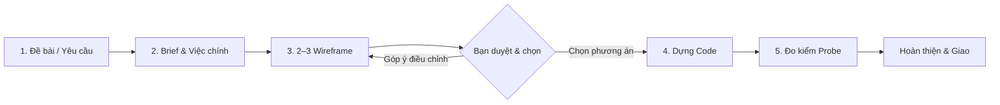

<div align="center">

# ⚡ lucas-kit

### **Engine thiết kế & dựng UI/UX chuyên nghiệp cho AI Coding Assistants**

[](LICENSE)
[](#-cài-đặt)
[](#-cẩm-nang-ra-lệnh-command-cheatsheet)
[](.claude-plugin/plugin.json)

<p align="center">
  Dựng màn hình app, dashboard, table, form, modal và design system chuẩn xác theo đúng thư viện component và màu sắc nhận diện của dự án — <b>loại bỏ hoàn toàn giao diện AI cẩu thả, không phá vỡ cấu trúc hiện có.</b>
</p>

[Hướng Dẫn Sử Dụng Chi Tiết](HUONG_DAN_SU_DUNG.md) • [Tính Năng](#-tính-năng-nổi-bật) • [Quy Trình](#-quy-trình-làm-việc-chuẩn-designer) • [Cài Đặt](#-cài-đặt) • [Cẩm Nang Ra Lệnh](#-cẩm-nang-ra-lệnh-command-cheatsheet) • [Công Cụ Đo Đạc](#-bộ-công-cụ-kiểm-thử-tự-động-probemjs)

---

</div>

> 📖 **Bạn mới bắt đầu?** Xem ngay [Cẩm Nang Hướng Dẫn Sử Dụng Chi Tiết (HUONG_DAN_SU_DUNG.md)](HUONG_DAN_SU_DUNG.md) để nắm trọn công thức viết prompt, 5 kịch bản thực chiến và checklist nghiệm thu giao diện.


## 🌟 Tính Năng Nổi Bật

* 🎯 **Quy trình chuẩn Designer**: Đi từ Briefing → 2–3 phương án Wireframe tương tác → Bạn duyệt → Dựng code chi tiết.
* 📏 **Ràng buộc bằng số học**: Quy chuẩn khắt khe về nhịp khoảng cách (spacing rhythm), thang kích thước chữ (typography scale), độ tương phản WCAG và vùng chạm tối thiểu (tap target ≥ 32px).
* 🛡️ **Triệt tiêu "AI Slop"**: Bộ luật nghiêm ngặt loại bỏ những thói quen thiết kế cẩu thả đặc trưng của AI (viền và bóng giả tạo, xuống dòng ngắt từ vô nghĩa, cắt chữ mất dữ liệu).
* 🧩 **Tôn trọng Tech Stack dự án**: Tự động nhận diện và tái sử dụng đúng thư viện component sẵn có (`shadcn/ui`, `Tailwind CSS v4`, `Radix`, `MUI`, `Ant Design`, HTML thuần) cùng hệ thống token nhận diện.
* 🔬 **Tự động đo kiểm Responsive (`probe.mjs`)**: Script Playwright tự động quét 6 độ phân giải (375px → 1920px) và kéo co dãn từng bước 20px (sweep) để phát hiện mọi lỗi vỡ layout, tràn cuộn ngang trước khi hoàn thành.

---

## 🔄 Quy Trình Làm Việc Chuẩn Designer



> [!NOTE]
> Mặc định skill vận hành như một Designer độc lập: **Hỏi đúng 2 lần** (khi chốt brief và khi chọn wireframe). Các bước còn lại skill tự chọn giải pháp tối ưu theo bộ quy chuẩn và báo cáo cụ thể trong bản giao.

---

## 💻 Cài Đặt

### 1. Claude Code

**Cách A: Cài trực tiếp từ GitHub Marketplace**
```bash
/plugin marketplace add Kaito2013/lucas-kit
/plugin install lucas@lucas-kit
```

**Cách B: Cài từ thư mục local máy bạn**
```bash
/plugin marketplace add /Users/hoaiminh/lucas-kit
/plugin install lucas@lucas-kit
```

> [!TIP]
> Để cập nhật bản mới nhất sau này trong Claude Code:
> ```bash
> /plugin marketplace update lucas-kit
> ```

---

### 2. Antigravity (IDE & CLI)

Antigravity tự động kích hoạt skill khi đặt vào thư mục cấu hình:

```bash
# Cài đặt cho Antigravity IDE
mkdir -p ~/.gemini/config/skills
cp -r /Users/hoaiminh/lucas-kit/skills/ui-ux ~/.gemini/config/skills/

# Hoặc cài đặt cho Antigravity CLI
mkdir -p ~/.gemini/antigravity-cli/skills
cp -r /Users/hoaiminh/lucas-kit/skills/ui-ux ~/.gemini/antigravity-cli/skills/
```

---

### 3. OpenAI Codex

Tích hợp vào project cụ thể hoặc thư mục dùng chung:

```bash
# Dùng chung cho toàn hệ thống
mkdir -p ~/.agents/skills
cp -r /Users/hoaiminh/lucas-kit/skills/ui-ux ~/.agents/skills/
```

---

## 📖 Cẩm Nang Ra Lệnh (Command Cheatsheet)

Cú pháp gọi lệnh: **`/lucas:ui-ux <nội dung đề bài>`**

| Nhu cầu thực tế | Câu lệnh mẫu | Hành vi xử lý |
| :--- | :--- | :--- |
| **Dựng màn mới (Mặc định)** | `/lucas:ui-ux Dựng màn danh sách đơn hàng: mã đơn, khách hàng, tổng tiền, trạng thái.` | Brief → Chờ duyệt → 2–3 Wireframe tương tác (bật/tắt màu, đổi mobile) → Bạn chọn phương án → Dựng code chi tiết. |
| **Dựng nhanh (Bỏ wireframe)** | `/lucas:ui-ux Dựng luôn màn cài đặt thông báo.` *(hoặc thêm `... just build it`)* | Bỏ qua bước wireframe để tiết kiệm thời gian & token. Tự chọn bố cục tối ưu nhất và dựng luôn. |
| **Xây dựng Design System** | `/lucas:ui-ux Dựng design system cho app phòng khám trước, chưa cần màn nào.` | Tạo trang `/design-system` chuẩn hóa Token và 7 component nền tảng (Button, Badge, Input, Card, List Row, Modal, Empty State). |
| **Soi & Bắt lỗi UI đang có** | `/lucas:ui-ux Xem giúp trang này chỗ nào chưa ổn: http://localhost:3000/orders` | Khởi động probe đo lường, xuất bảng phân tích lỗi kèm ảnh so sánh Trước/Sau để bạn duyệt sửa. |
| **Tối ưu UI nhưng giữ Brand** | `/lucas:ui-ux Dựng lại trang này giữ brand.` | Làm gọn card, tinh chỉnh control, chuẩn hóa khoảng cách nhưng giữ nguyên 100% màu sắc nhận diện thương hiệu. |
| **Làm mới theo gu hiện đại** | `/lucas:ui-ux Dựng lại hoàn toàn theo gu skill, bỏ style cũ.` | Tái cấu trúc toàn diện diện mạo, chuẩn hóa hệ thống phân cấp thị giác hiện đại (chỉ giữ logo và màu nhấn). |
| **Refactor CSS sạch** | `/lucas:ui-ux Refactor CSS trang /settings sang Tailwind, giữ nguyên giao diện.` | Viết lại CSS sạch sẽ, xóa bỏ class thừa, cam kết không làm lệch giao diện 1 pixel nào. |

---

## 🛠️ Bộ Công Cụ Kiểm Thử Tự Động (`probe.mjs`)

`lucas-kit` tích hợp sẵn công cụ đo lường chuyên sâu bằng Headless Chromium (`Playwright`):

```bash
# Chạy đo lường và chụp ảnh đối chiếu
node skills/ui-ux/scripts/probe.mjs <url> [--widths 375,768,1024,1280,1440,1920] [--sweep] [--dark]
```

### Các hạng mục tự động đo kiểm:
* **Sweep Viewport (1440px → 375px)**: Kéo co dãn từng bước 20px để phát hiện các breakpoint bị vỡ hàng, rớt chữ, tràn cuộn ngang.
* **Tap Target Compliance**: Đảm bảo toàn bộ phần tử tương tác (button, icon, input) đạt kích thước tối thiểu `32px` (chuẩn `44px` cho mobile).
* **Keyboard Navigation**: Tự động bấm `Tab` kiểm tra đường đi focus, phát hiện focus trap và viền focus bị che khuất.
* **Contrast & State Checking**: So sánh độ tương phản chữ trên nền thực tế, kiểm tra trạng thái hover, selected, modal overlay.

---

## 📐 Hệ Thống Quy Chuẩn Thiết Kế

Tất cả các quyết định giao diện đều được đối chiếu từ kho tài liệu quy tắc trong `skills/ui-ux/references/`:

| Ký hiệu | Nhóm quy tắc | Nội dung kiểm soát |
| :---: | :--- | :--- |
| **`N`** | **Principles** | 12 nguyên tắc cốt lõi về thị giác, phân cấp thông tin và tính nhất quán. |
| **`M`** | **Color & Contrast** | Quy chuẩn phối màu nền, viền, shadow, dark mode và token ngữ nghĩa. |
| **`T`** | **Typography** | Thang font, line-height, luật ngắt dòng, quy tắc cắt chữ an toàn (truncate). |
| **`F`** | **Form & Geometry** | Lưới (grid), bo góc (radius), nhịp padding, icon và trường nhập liệu. |
| **`I`** | **Interactive States** | Quy tắc nút nhấn, vùng nguy hiểm (destructive), hover, focus, empty và loading. |
| **`R`** | **Responsive** | Xử lý màn hình hẹp (ngưỡng 375px), thanh điều hướng mobile, thanh đáy (bottom bar). |
| **`D`** | **Design System** | Quy chuẩn mở rộng nhiều màn, quản lý token tập trung và component tái sử dụng. |

---

## 💡 Lời Khuyên Khi Sử Dụng

1. **Cung cấp link localhost thật**: Giúp công cụ tự mở trình duyệt, chụp ảnh và đo lường chính xác các trạng thái thực tế.
2. **Cung cấp dữ liệu mẫu chân thực**: Dữ liệu có độ dài ngắn khác nhau giúp kiểm tra khả năng tràn dòng và cắt chữ thực tế.
3. **Phản hồi Wireframe theo mã khối**: Mỗi khối trong wireframe đều có đánh số, bạn chỉ cần gõ: *"bỏ khối 3, đưa khối 2 lên đầu"*.
4. **Tách biệt Logic và Giao diện**: Giao diện, bố cục và trạng thái là việc của `lucas-kit`; việc xử lý API, schema và validate dữ liệu là phần việc của bạn.

---

## 📄 Bản Quyền & Tài Liệu Phát Triển

Phát hành theo giấy phép **MIT License**. Xem chi tiết tại [LICENSE](LICENSE).  
Chi tiết quy trình phát triển và kiểm thử: [DEVELOP.md](DEVELOP.md).
